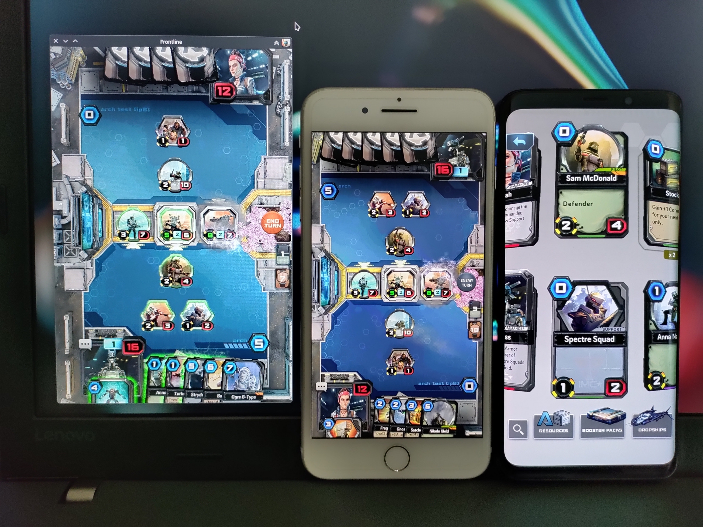

Welcome (back) to Titanfall Frontline!

9 years after being shut down the game is finally back online in a playable state.
But we didn't just make it playable, we made it better than ever before.
We ported the game to work on more platforms than it originally did, fixed a lot of bugs, and added many quality of life improvements.

{/* truncate */}

Download the game for your platform [here](/download)!

Some things you should know before you start playing:

- The original game never made it out of public beta, and so there are likely still some bugs in there we haven't fixed yet. The balancing is probably also not great because of this.
- This is not the latest version of Frontline. We don't have the assets for that unfortunately, so this game should still be partially considered lost media.
- The starting cards and dropships (decks) had to be re-created based on YouTube videos of the game, unfortunately none of them showed the full dropships, so these are likely to be very unbalanced.
- After creating a TOY account the game may timeout in the background, this is fine, just click "Ok" and press "Guest Player".
- On mobile devices some UI elements may go offscreen or feel cramped, we've done our best to prevent this however properly fixing it would be so much work we decided we didn't want to do it.

If after playing the tutorial you find yourself confused about how to play, check out the [gameplay guide](/docs/frontline/guide/how-to-play) written by LightAngel.

We hope you enjoy re-experiencing or perhaps even playing Frontline for the first time!
