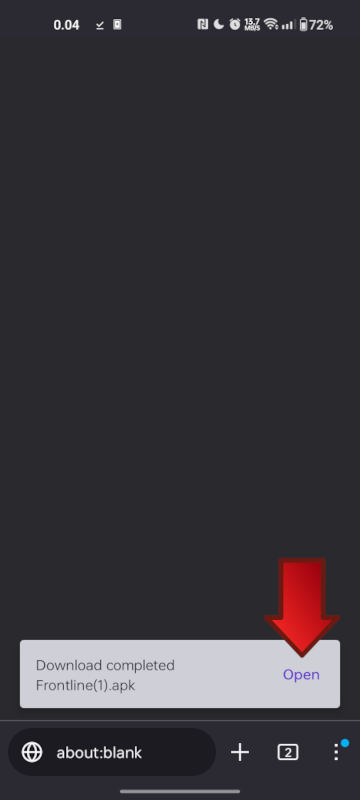
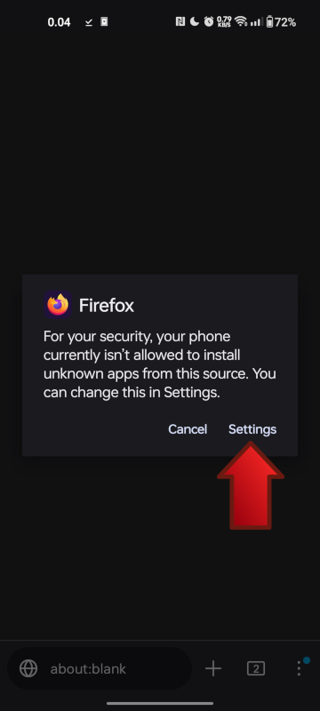
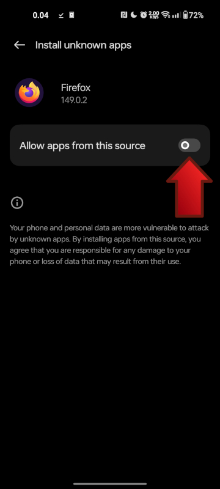
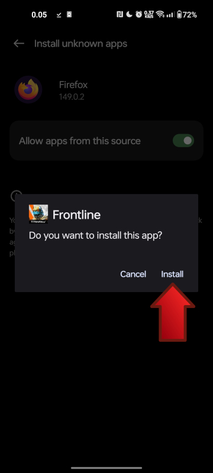

# Android

## Requirements

- Android 5.1 (Lollipop) or higher
- At least 500 MB of free storage space

## 1. Download the APK

Get the latest Android APK by [clicking here](https://cdn-cf.tfflinternal.com/frontline/Frontline.apk).

## 2. Install the APK

Once downloaded, tap on the APK file to start the installation process.

If you haven't already, you may be prompted to allow installation from unknown sources.
To do this, follow the prompts to enable this setting in your device's settings.

Once you've allowed installation from unknown sources, simply go back and the installation process should begin.
