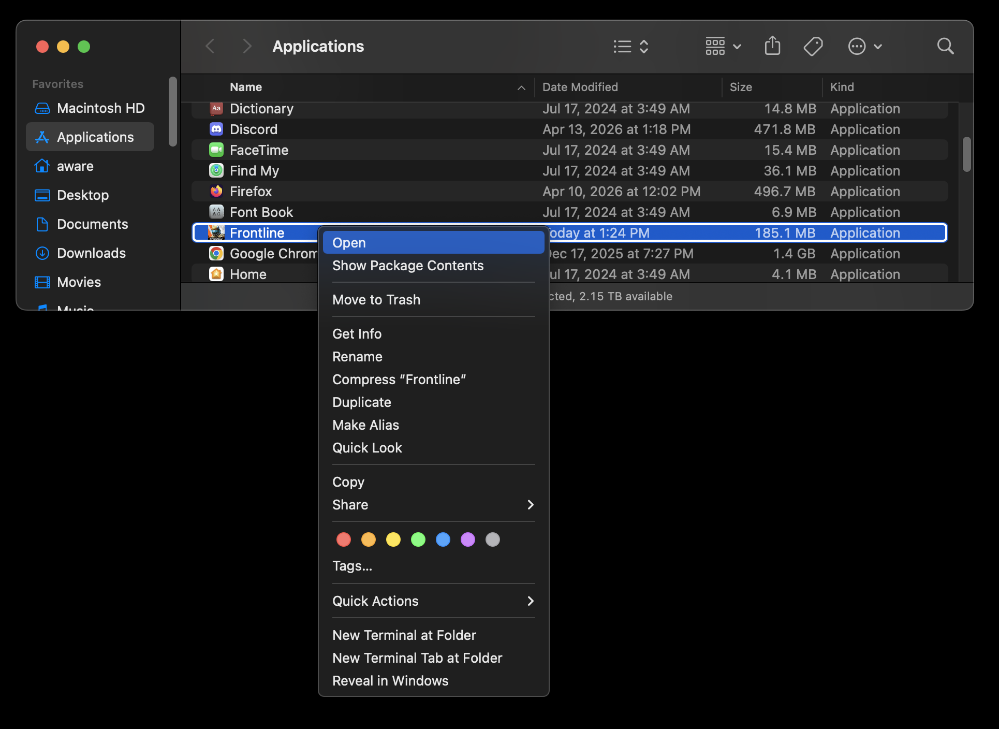

# Mac

## Requirements

- macOS 10.14 (Mojave) or higher
- At least 500 MB of free storage space

## 1. Download the disk image

Get the latest macOS installer by [clicking here](https://cdn-cf.tfflinternal.com/frontline/Frontline.dmg).

## 2. Install the application

Once downloaded, open the disk image and drag the Frontline application to your Applications folder.

:::note

If the application is blocked from opening, right click (secondary click/control click) on it and select "Open".

:::

