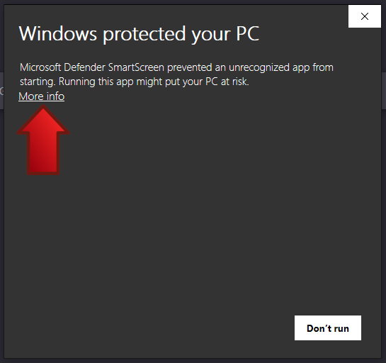
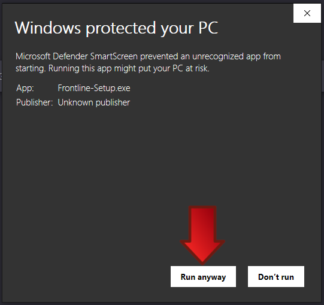
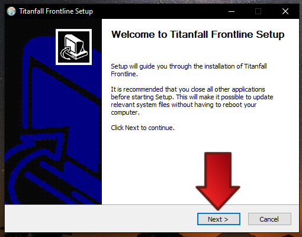
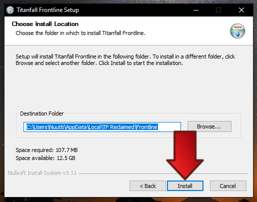

# Windows

## Requirements

- Windows 7 or higher
- At least 500 MB of free storage space
- 64-bit processor
- DX11 compatible graphics card

## 1. Download the installer

Get the latest Windows installer by [clicking here](https://cdn-cf.tfflinternal.com/frontline/Frontline-Setup.exe).

## 2. Run the installer

Once downloaded, run the installer. You may see a warning about the app being from an unknown publisher.
Click on "More info" and then "Run anyway" to proceed with the installation.

Follow the prompts in the installer. You can change the installation location if you are running low on disk space.
